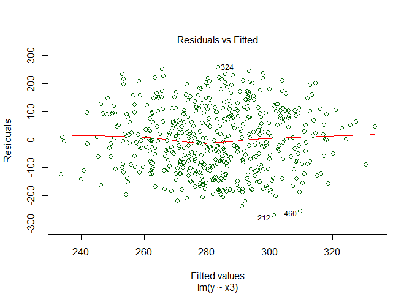

#### See githup <https://github.com/GaryFH/OPTIONALRegression-practice>

Overview
========

### This is an optional assignment the instructions follow:

##### "We are conducting research on the ways that people use data analysis and data science tools. Your participation in this non-graded and completely optional peer assessment will be part of that research. We will not collect any personally identifiable information about you for the purposes of this research and only aggregated totals of responses to questions will be reported. The potential risks to you are small. The potential benefits to the community of data scientists, developers, and professors are very high – we will be able to figure out which methods work and which methods do not. This exercise is 100% optional and will not have any influence whatsoever on your grade in the class. Thanks for considering helping us learn about data science!"

#### Note that some of the comments I used are partially copied from PennState's STAT 501/Regression Methods and from "Quick Guide: Interpreting Simple Linear Model Output in R" by Felipe Rego - October 2015

Get data, setup work environment and tidy
-----------------------------------------

#### open from working directory

    library(dplyr)

    ## Warning: package 'dplyr' was built under R version 3.3.3

    ## 
    ## Attaching package: 'dplyr'

    ## The following objects are masked from 'package:stats':
    ## 
    ##     filter, lag

    ## The following objects are masked from 'package:base':
    ## 
    ##     intersect, setdiff, setequal, union

    library(ggplot2)

    ## Warning: package 'ggplot2' was built under R version 3.3.3

    data1<-read.csv("_cf0fd3361e05f5be5304b07b771bad48_companydata.csv", stringsAsFactors=F)
    df1<-tbl_df(data1)
    summary(df1)

    ##        y                x1               x2              x3         
    ##  Min.   : 32.44   Min.   : 18.84   Min.   :20.15   Min.   :-76.175  
    ##  1st Qu.:188.86   1st Qu.:123.71   1st Qu.:40.65   1st Qu.:-12.858  
    ##  Median :274.45   Median :178.03   Median :58.10   Median :  8.846  
    ##  Mean   :282.41   Mean   :184.90   Mean   :59.65   Mean   :  8.206  
    ##  3rd Qu.:376.85   3rd Qu.:245.69   3rd Qu.:78.73   3rd Qu.: 29.737  
    ##  Max.   :542.13   Max.   :339.12   Max.   :99.69   Max.   : 95.953

Fun with graphs - plot x1, x2, x3 vrs y and show lm for each
------------------------------------------------------------

            g<-ggplot()+
            geom_point(data=df1,aes(x=x1,y=y),alpha=.2,color="orange")+
            geom_smooth(data=df1,aes(x=x1,y=y),color="dark orange",method = lm, se=F)+
            geom_point(data=df1,aes(x=x2,y=y),alpha=.1,color="magenta")+
            geom_smooth(data=df1,aes(x=x2,y=y),color="dark magenta",method = lm, se=F)+
            geom_point(data=df1,aes(x=x3,y=y),alpha=.2,color="green")+
            geom_smooth(data=df1,aes(x=x3,y=y),color="dark green",method = lm, se=F)+
            labs(title="y data vrs three different x variables")+
            labs(x="Orange is x1 - Magenta is x2 - Green is x3",y="y data")
    g

#### The plot suggests that there is a increasing linear relationship between all three "x" values and the "y" data. It also suggests that there are no unusual data points in the data set. And, it illustrates that the variation around the estimated regression line is constant suggesting that the assumption of equal error variances is reasonable. Note that it appears that "x1" data has the weakest correlation (the data most spread out from the regression line) and the slope of the x1 regression line is the least. We are dealing with a statistical relationship, in which the relationship between the variables is not perfect. The above plot is an example of a statistical relationship (not a deterministic relationships where the equation exactly describes the relationship between the two variables). Since we are interested in summarizing the trend between two quantitative variables, the natural question arises — "what is the best fitting line?" - in this case we used the "lm" method of linear regression in "r" to determine the "best fitting line".

Look at summary functions as follows:
-------------------------------------

#### The model above is achieved by using the lm() function in R and the output is called using the summary() function on the model and briefly explain each component of the model output:

### Formula Call

##### As you can see, the first item shown in the output is the formula R used to fit the data. Note the simplicity in the syntax: the formula just needs the predictor (x1) and the target/response variable (y), together with the data being used (df1).

### Residuals

##### Residuals are essentially the difference between the actual observed response values and the response values that the model predicted. The Residuals section of the model output breaks it down into 5 summary points. When assessing how well the model fit the data, you should look for a symmetrical distribution across these points on the mean value zero. We could take this further consider plotting the residuals to see whether this normally distributed, etc - see plots below.

### Coefficients

##### The next section in the model output talks about the coefficients of the model. Theoretically, in simple linear regression, the coefficients are two unknown constants that represent the intercept and slope terms in the linear model. If we wanted to predict y given x1, we would get a training set and produce estimates of the coefficients to then use it in the model formula. Ultimately, the analyst wants to find an intercept and a slope such that the resulting fitted line is as close as possible to data points in our data set.

### Coefficient - Estimate

##### The coefficient Estimate contains two rows; the first one is the intercept. The second row in the Coefficients is the slope.

### Coefficient - Standard Error

##### The coefficient Standard Error measures the average amount that the coefficient estimates vary from the actual average value of our response variable. We’d ideally want a lower number relative to its coefficients. In our example, we’ve previously determined that for every "1" increase in x1 - y will increase "1.38705". The Standard Error can be used to compute an estimate of the expected difference in case we ran the model again and again. In other words, we can say that "y" can vary by 0.031 (pretty small). The Standard Errors can also be used to compute confidence intervals and to statistically test the hypothesis of the existence of a relationship between speed and distance required to stop.

### Coefficient - t value

##### The coefficient t-value is a measure of how many standard deviations our coefficient estimate is far away from 0. We want it to be far away from zero as this would indicate we could reject the null hypothesis - that is, we could declare a relationship between x1 and y exist. In our example, the t-statistic values are relatively far away from zero and are large relative to the standard error, which could indicate a relationship exists. In general, t-values are also used to compute p-values.

### Coefficient - Pr(&gt;|t|)

##### The Pr(&gt;|t|) acronym found in the model output relates to the probability of observing any value equal or larger than |t|. A small p-value indicates that it is unlikely we will observe a relationship between the predictor (x1) and response (y) variables due to chance. Typically, a p-value of 5% or less is a good cut-off point. In our model example, the p-values are very close to zero. Note the ‘signif. Codes’ associated to each estimate. Three stars (or asterisks) represent a highly significant p-value. Consequently, a small p-value for the intercept and the slope indicates that we can reject the null hypothesis which allows us to conclude that there is a relationship between speed and distance.

### Residual Standard Error

##### Residual Standard Error is measure of the quality of a linear regression fit. Theoretically, every linear model is assumed to contain an error term E. Due to the presence of this error term, we are not capable of perfectly predicting our response variable (y) from the predictor (x1) one. The Residual Standard Error is the average amount that the response (y) will deviate from the true regression line. In our example(mtcars), the actual "y"value can deviate from the regression line by approximately 51.8, on average. In other words, given that the mean distance of 25.945 and that the Residual Standard Error is 51.8, we can say that the percentage error is (any prediction would still be off by) 199.7% - Note that without dimension, this doesn't appear to mean much. It’s also worth noting that the Residual Standard Error was calculated with 498 degrees of freedom. Simplistically, degrees of freedom are the number of data points that went into the estimation of the parameters used after taking into account these parameters (restriction). In our case, we had 500 data points and two parameters (intercept and slope).

### Multiple R-squared, Adjusted R-squared

##### The R-squared statistic (R^2) provides a measure of how well the model is fitting the actual data. It takes the form of a proportion of variance. The (R^2)is a measure of the linear relationship between our predictor variable (x) and our response / target variable (y). It always lies between 0 and 1 (i.e.: a number near 0 represents a regression that does not explain the variance in the response variable well and a number close to 1 does explain the observed variance in the response variable). In our example, the (R^2) we get is 0.7998. Or roughly 80% of the variance found in the response variable (y) can be explained by the predictor variable (x1). It should be noted that .8 indicates that x1 is a predictor of y. That why we get a relatively strong (R^2). Nevertheless, it’s hard to define what level of (R^2)is appropriate to claim the model fits well. Essentially, it will vary with the application and the domain studied. A side note: In multiple regression settings, the (R^2)will always increase as more variables are included in the model. That’s why the adjusted (R^2) is the preferred measure as it adjusts for the number of variables considered.

### F-Statistic

##### F-statistic is a good indicator of whether there is a relationship between our predictor and the response variables. The further the F-statistic is from 1 the better it is. However, how much larger the F-statistic needs to be depends on both the number of data points and the number of predictors. Generally, when the number of data points is large, an F-statistic that is only a little bit larger than 1 is already sufficient to reject the null hypothesis (H0 : There is no relationship between x1 and y). The reverse is true as if the number of data points is small, a large F-statistic is required to be able to ascertain that there may be a relationship between predictor and response variables. In our example the F-statistic is 1990 which is relatively larger than 1 given the size of our data.

    a1<-lm(y~x1,df1)
    summary(a1)

    ## 
    ## Call:
    ## lm(formula = y ~ x1, data = df1)
    ## 
    ## Residuals:
    ##     Min      1Q  Median      3Q     Max 
    ## -156.06  -33.13   -1.23   36.09  139.83 
    ## 
    ## Coefficients:
    ##             Estimate Std. Error t value Pr(>|t|)    
    ## (Intercept) 25.94506    6.19828   4.186 3.36e-05 ***
    ## x1           1.38705    0.03109  44.610  < 2e-16 ***
    ## ---
    ## Signif. codes:  0 '***' 0.001 '**' 0.01 '*' 0.05 '.' 0.1 ' ' 1
    ## 
    ## Residual standard error: 51.8 on 498 degrees of freedom
    ## Multiple R-squared:  0.7998, Adjusted R-squared:  0.7994 
    ## F-statistic:  1990 on 1 and 498 DF,  p-value: < 2.2e-16

    a2<-lm(y~x2,df1)
    summary(a2)

    ## 
    ## Call:
    ## lm(formula = y ~ x2, data = df1)
    ## 
    ## Residuals:
    ##      Min       1Q   Median       3Q      Max 
    ## -127.963  -28.312    0.004   29.609  123.508 
    ## 
    ## Coefficients:
    ##             Estimate Std. Error t value Pr(>|t|)    
    ## (Intercept)  -1.5783     5.2574   -0.30    0.764    
    ## x2            4.7608     0.0824   57.78   <2e-16 ***
    ## ---
    ## Signif. codes:  0 '***' 0.001 '**' 0.01 '*' 0.05 '.' 0.1 ' ' 1
    ## 
    ## Residual standard error: 41.72 on 498 degrees of freedom
    ## Multiple R-squared:  0.8702, Adjusted R-squared:  0.8699 
    ## F-statistic:  3338 on 1 and 498 DF,  p-value: < 2.2e-16

    a3<-lm(y~x3,df1)
    summary(a3)

    ## 
    ## Call:
    ## lm(formula = y ~ x3, data = df1)
    ## 
    ## Residuals:
    ##      Min       1Q   Median       3Q      Max 
    ## -268.758  -91.529   -3.845   92.356  258.653 
    ## 
    ## Coefficients:
    ##             Estimate Std. Error t value Pr(>|t|)    
    ## (Intercept) 277.6493     5.2840  52.546  < 2e-16 ***
    ## x3            0.5805     0.1624   3.575 0.000385 ***
    ## ---
    ## Signif. codes:  0 '***' 0.001 '**' 0.01 '*' 0.05 '.' 0.1 ' ' 1
    ## 
    ## Residual standard error: 114.3 on 498 degrees of freedom
    ## Multiple R-squared:  0.02502,    Adjusted R-squared:  0.02306 
    ## F-statistic: 12.78 on 1 and 498 DF,  p-value: 0.0003849

    a4<-lm(y~x1+x2,df1)
    summary(a4)

    ## 
    ## Call:
    ## lm(formula = y ~ x1 + x2, data = df1)
    ## 
    ## Residuals:
    ##      Min       1Q   Median       3Q      Max 
    ## -131.941  -28.231    0.108   30.473  123.991 
    ## 
    ## Coefficients:
    ##             Estimate Std. Error t value Pr(>|t|)    
    ## (Intercept) -2.17846    5.27027  -0.413    0.680    
    ## x1          -0.13253    0.09543  -1.389    0.166    
    ## x2           5.18163    0.31402  16.501   <2e-16 ***
    ## ---
    ## Signif. codes:  0 '***' 0.001 '**' 0.01 '*' 0.05 '.' 0.1 ' ' 1
    ## 
    ## Residual standard error: 41.68 on 497 degrees of freedom
    ## Multiple R-squared:  0.8707, Adjusted R-squared:  0.8702 
    ## F-statistic:  1673 on 2 and 497 DF,  p-value: < 2.2e-16

    a5<-lm(y~x1+x2+x3,df1)
    summary(a5)

    ## 
    ## Call:
    ## lm(formula = y ~ x1 + x2 + x3, data = df1)
    ## 
    ## Residuals:
    ##      Min       1Q   Median       3Q      Max 
    ## -131.672  -28.472    0.597   30.258  123.630 
    ## 
    ## Coefficients:
    ##             Estimate Std. Error t value Pr(>|t|)    
    ## (Intercept) -2.09331    5.28770  -0.396    0.692    
    ## x1          -0.13048    0.09592  -1.360    0.174    
    ## x2           5.17188    0.31705  16.313   <2e-16 ***
    ## x3           0.01418    0.06032   0.235    0.814    
    ## ---
    ## Signif. codes:  0 '***' 0.001 '**' 0.01 '*' 0.05 '.' 0.1 ' ' 1
    ## 
    ## Residual standard error: 41.72 on 496 degrees of freedom
    ## Multiple R-squared:  0.8707, Adjusted R-squared:  0.8699 
    ## F-statistic:  1113 on 3 and 496 DF,  p-value: < 2.2e-16

Look at "Residuals vrs Fitted" for the same alternatives shown above (and the some combined "x" variables).
-----------------------------------------------------------------------------------------------------------

    plot(a1,which=1,col="dark orange")

    plot(a2,which=1,col="dark magenta")

    plot(a3,which=1,col="dark green")

    plot(a4,which=1, col="blue")

    plot(a5,which=1,col="red")

#### Note that, as defined, the residuals appear on the y axis and the fitted values appear on the x axis. You should be able to look back at the scatter plot of the data and see how the data points there correspond to the data points in the residual versus fits plot here. In case you're having trouble with doing that, look at five specific data points in the original scatter plot. Note that the predicted response (fitted value) is consisant with the observed. Also, note the pattern in which the five data points deviate from the estimated regression line (brackets the line well). Now look at how and where these five data points appear in the residuals versus fits plot. Their deviation from the residual = 0 line shares the same pattern as their deviation from the estimated regression line. Do you see the connection? Any data point that falls directly on the estimated regression line has a residual of 0. Therefore, the residual = 0 line corresponds to the estimated regression line. Let's take a look at that residuals versus fits plot again. All plots look like classical examples of a well-behaved residuals vs. fits plot.

Here are the characteristics of a well-behaved residual vs. fits plot and what they suggest about the appropriateness of the simple linear regression model:
------------------------------------------------------------------------------------------------------------------------------------------------------------

#### 1) The residuals "bounce randomly" around the 0 line. This suggests that the assumption that the relationship is linear is reasonable.

#### 2) The residuals roughly form a "horizontal band" around the 0 line. This suggests that the variances of the error terms are equal.

#### 4) No one residual "stands out" from the basic random pattern of residuals. This suggests that there are no outliers.

#### 5) In general, you want your residual vs. fits plots to look something like the above plot. Don't forget though that interpreting these plots is subjective. My experience has been that students learning residual analysis for the first time tend to over-interpret these plots, looking at every twist and turn as something potentially troublesome. You'll especially want to be careful about putting too much weight on residual vs. fits plots based on small data sets. Sometimes the data sets are just too small to make interpretation of a residuals vs. fits plot worthwhile.

Summary
=======

### A first look at the scatter plots (smoothed with lm) shows a strong and positive correlation between all the x variables and y.

### The summaries of the lm()function gives a high "Adjusted R-squared" value for y~x1, y~x2, y~x1+x2 and y~x1+x2+x3 (all over 79% - they all also have F-statistic values over 1,100). However y~x3 has a Adjusted R-squared of only 2.3%, a F-statistic of only 12.78 and a "p"value of .000385 (small but significantly larger than the others.)

### I found no information about the data (no dimensions or variable explanations) - I would like to know more before committing myself. That said - the data appears to show a strong relationship between the "x" variables and "y" - even "x3" though the relationship appears less strong per the lm() function for x3.
